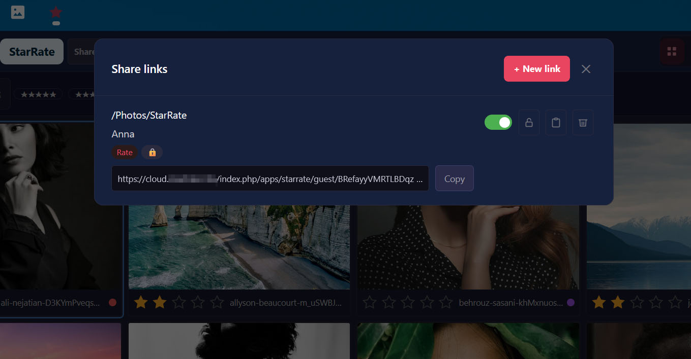
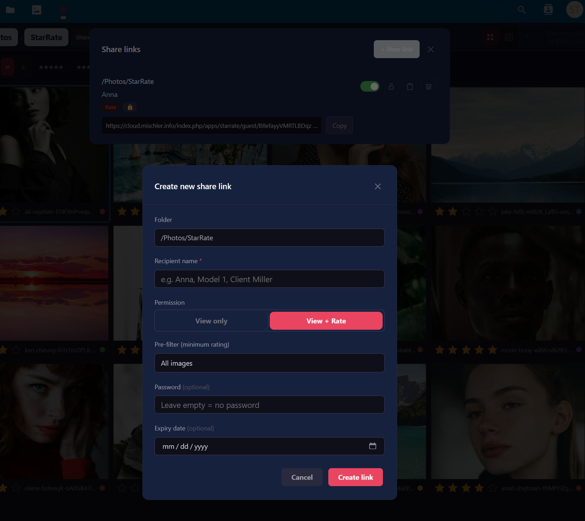

# StarRate

**Professional photo rating and review tool for Nextcloud** — inspired by Lightroom Classic.

StarRate lets photographers rate, label and curate their images directly inside Nextcloud using star ratings (0–5), color labels and Pick/Reject flags. Ratings are written both to Nextcloud Collaborative Tags and into JPEG XMP metadata. A guest-share feature lets clients or models review and rate a selection without a Nextcloud account.

---

## Screenshots

### Grid view with star ratings and color labels


### Loupe view with zoom and keyboard navigation


### Share link management


### Create a new share link


### Guest gallery — rate without a Nextcloud account


---

## Features

| Feature | Description |
|---|---|
| **Star rating** | 0–5 stars, hover preview, keyboard shortcuts 0–5 |
| **Color labels** | Red / Yellow / Green / Blue / Purple (keys 6–9) |
| **Pick / Reject** | Flag images with P / X — enable in Settings |
| **XMP metadata** | Ratings written directly into JPEG (APP1 segment) |
| **Filter bar** | Combinable filters by stars, color, Pick/Reject, unrated |
| **Loupe view** | Zoom 25–400 %, pan, pinch-to-zoom, keyboard navigation |
| **Batch rating** | Shift+click / Ctrl+click, Ctrl+A, floating selection bar |
| **Guest sharing** | Public gallery links with optional password and expiry |
| **Dark theme** | Anthracite UI (#1a1a2e) with red accent (#e94560) |
| **i18n** | English and German |

---

## Requirements

- **Nextcloud** 29–32
- **PHP** 8.1–8.4
- **Node.js** 18+ / npm 9+
- **Composer** 2

---

## Installation

### From the Nextcloud App Store

Search for **StarRate** in the Apps section of your Nextcloud admin panel and click **Install**.

### Manual installation

```bash
git clone https://github.com/merlin1de/starrate.git /var/www/nextcloud/custom_apps/starrate
cd /var/www/nextcloud/custom_apps/starrate
composer install --no-dev
npm ci && npm run build
sudo -u www-data /var/www/nextcloud/occ app:enable starrate
```

---

## Development

### Install dependencies

```bash
make install-deps
```

### Run tests

```bash
make test          # PHPUnit + Vitest
make test-php      # PHPUnit only
make test-js       # Vitest only
make test-e2e      # Cypress (requires a running Nextcloud instance)
make test-coverage # Reports written to tests/results/
```

### Build

```bash
make build         # production bundle → js/
```

### Lint

```bash
make lint          # PHP_CodeSniffer + ESLint
```

---

## Directory structure

```
starrate/
├── appinfo/
│   ├── info.xml             # App manifest (metadata, routes)
│   └── routes.php           # API routes
├── css/
│   └── starrate.css         # Dark theme base styles
├── js/                      # Vite build output (not committed)
├── l10n/
│   ├── de.js / de.json      # German translations
│   └── en.js / en.json      # English translations
├── lib/
│   ├── Controller/          # OCA HTTP controllers
│   ├── Migration/           # Database migration (InstallStep)
│   ├── Service/             # Business logic
│   └── Settings/            # User settings
├── screenshots/             # App Store / README screenshots
├── src/
│   ├── components/          # Vue components
│   ├── views/               # Vue views (Gallery, Sync, Guest)
│   ├── main.js              # Main app entry point
│   └── guest.js             # Guest gallery entry point
├── templates/
│   ├── index.php            # Main SPA template
│   ├── guest.php            # Guest gallery (no NC layout)
│   └── settings/
│       └── personal.php     # Personal settings page
├── tests/
│   ├── Unit/                # PHPUnit tests
│   ├── e2e/                 # Cypress tests
│   ├── fixtures/            # Binary test fixtures
│   └── js/                  # Vitest component tests
├── composer.json
├── package.json
├── phpunit.xml
├── vite.config.js
└── vitest.config.js
```

---

## Configuration

### Personal settings

Available under **Nextcloud → Settings → Personal → StarRate**:

| Setting | Default | Description |
|---|---|---|
| `default_sort` | `name` | Sort order: `name`, `date`, `size` |
| `default_sort_order` | `asc` | Sort direction: `asc`, `desc` |
| `thumbnail_size` | `280` | Thumbnail width in pixels |
| `grid_columns` | `auto` | Column count (`auto` or fixed) |
| `show_filename` | `true` | Show filename on thumbnails |
| `show_rating_overlay` | `true` | Show star overlay on thumbnails |
| `show_color_overlay` | `true` | Show color dot on thumbnails |
| `enable_pick_ui` | `false` | Enable Pick (P) / Reject (X) flags and filter |

---

## Guest sharing

1. Open a folder → click the **Share** button
2. Set permission to **View + Rate** or **View only**
3. Optionally set a password, expiry date and minimum star filter
4. Copy the link and send it to your client or model

Guests can rate images without a Nextcloud account. The photographer sees all guest ratings in the share management panel.

---

## API overview

All endpoints under `/apps/starrate/api/`:

| Method | Path | Description |
|---|---|---|
| `GET` | `images` | Images in a folder with metadata |
| `GET` | `thumbnail/{fileId}` | JPEG thumbnail (cached) |
| `GET` | `rating/{fileId}` | Rating for an image |
| `POST` | `rating/{fileId}` | Set rating |
| `POST` | `rating/batch` | Batch rating |
| `DELETE` | `rating/{fileId}` | Remove rating |
| `GET` | `share` | List own share links |
| `POST` | `share` | Create share link |
| `PUT` | `share/{token}` | Update share link |
| `DELETE` | `share/{token}` | Delete share link |
| `GET` | `guest/{token}/images` | Guest: load images |
| `POST` | `guest/{token}/rate` | Guest: rate image |
| `GET` | `settings` | User settings |
| `POST` | `settings` | Save settings |

---

## Building a release package

```bash
make package
# → dist/starrate.tar.gz
```

The package contains only the files required for production (no `node_modules`, no `vendor`, no tests).

---

## License

AGPL-3.0-or-later — see [LICENSE](LICENSE).

For commercial licensing (e.g. mobile apps), contact: starrate@merlin1.de

---

## Contributing

Pull requests and bug reports are welcome. Please ensure before submitting:

```bash
make test    # all tests green
make lint    # no lint errors
make build   # build succeeds
```
