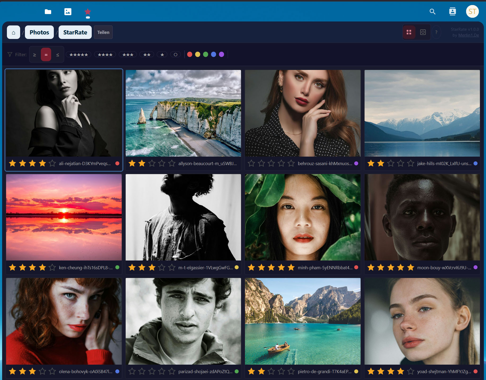
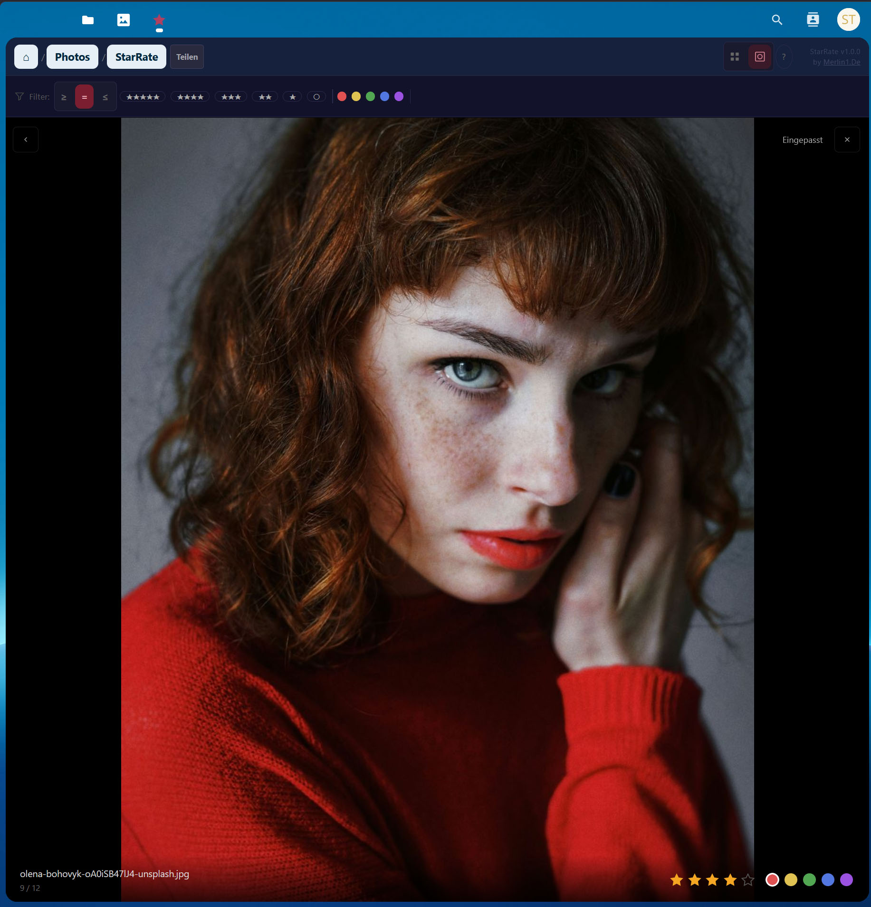
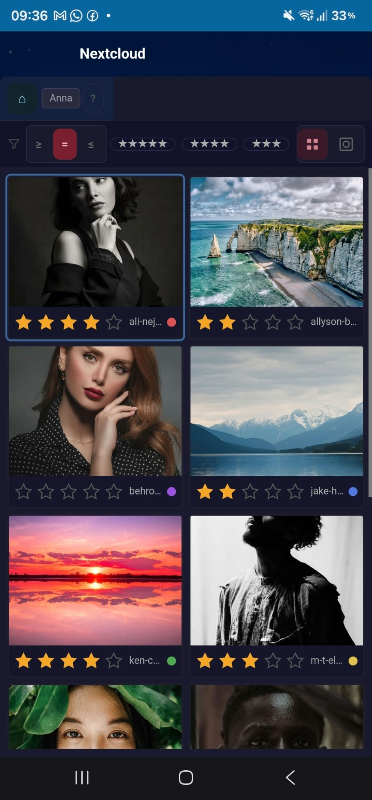

# StarRate — Lightroom-style Photo Rating for Nextcloud

**Rate, label and curate your photos directly in Nextcloud — with 1–5 stars, color labels, and XMP metadata that Lightroom, digiKam and F-Stop can read.**

[](https://github.com/merlin1de/starrate/actions/workflows/ci.yml)
[](https://apps.nextcloud.com/apps/starrate)
[](LICENSE)
[](https://apps.nextcloud.com/apps/starrate)
[](https://php.net)

> **The missing photo rating tool for Nextcloud photographers.**  
> Stop switching apps. Rate your shots, share a guest link with your client, and open them in Lightroom — the stars are already there.

---

## Why StarRate?

Photographers using Nextcloud for file storage hit the same two walls:

1. **No way to rate and curate photos inside Nextcloud** — you have to export to Lightroom, rate, re-import, repeat.
2. **No way to let a client pick favorites** without giving them your full Nextcloud access or sending a Google Drive link.

StarRate solves both — and it keeps your ratings inside the JPEG itself, so every app that reads XMP metadata sees them.

---

## XMP Metadata Compatibility

StarRate writes ratings directly into the **JPEG APP1 segment** (XMP standard). No sidecar files. No re-export needed.

| Application | Reads StarRate ratings |
|---|---|
| Adobe Lightroom Classic | ✅ |
| digiKam | ✅ |
| F-Stop (Android) | ✅ |
| Darktable | ✅ |
| Apple Photos | ❌ (no XMP star rating support) |

Rate in Nextcloud → open in Lightroom → stars are already there.

---

## Features

| Feature | Description |
|---|---|
| ⭐ Star rating | 0–5 stars, hover preview, keyboard shortcuts `0`–`5` |
| 🎨 Color labels | Red / Yellow / Green / Blue / Purple (keys `6`–`9`) |
| 🚩 Pick / Reject | Flag images with `P` / `X` — enable in Settings |
| 📝 XMP metadata | Ratings written directly into JPEG (APP1 segment) |
| 🔍 Filter bar | Combinable filters: stars, color, Pick/Reject, unrated |
| 🔎 Loupe view | Zoom 25–400 %, pan, pinch-to-zoom, keyboard navigation |
| 🖱️ Batch rating | `Shift+click` / `Ctrl+click`, `Ctrl+A`, floating selection bar |
| 🔗 Guest sharing | Public gallery links — clients rate without a Nextcloud account |
| 🌙 Dark theme | Anthracite UI (`#1a1a2e`) with red accent (`#e94560`) |
| 🌍 i18n | English and German |

---

## Screenshots

### Grid view with star ratings and color labels


### Loupe view with zoom and keyboard navigation


### Guest gallery — rate without a Nextcloud account


---

## Guest Sharing — The Client Workflow

1. Open a folder in StarRate → click **Share**
2. Set permission to **View + Rate** or **View only**
3. Optionally: add a password, expiry date, and minimum star filter
4. Copy the link → send to your client or model

Guests can rate images in their browser — **no Nextcloud account required**. The photographer sees all guest ratings in real time.

---

## Requirements

- Nextcloud 29–33
- PHP 8.1–8.4
- Node.js 18+ / npm 9+
- Composer 2

---

## Installation

### From the Nextcloud App Store *(recommended)*

Search for **StarRate** in the Apps section of your Nextcloud admin panel and click Install.

Or go directly: [apps.nextcloud.com/apps/starrate](https://apps.nextcloud.com/apps/starrate)

### Manual installation

```bash
git clone https://github.com/merlin1de/starrate.git /var/www/nextcloud/custom_apps/starrate
cd /var/www/nextcloud/custom_apps/starrate
composer install --no-dev
npm ci && npm run build
sudo -u www-data /var/www/nextcloud/occ app:enable starrate
```

---

## Coming Soon: Android App 🤖

A native Android app is in development:

- **Nextcloud SSO** account picker
- **Guest deep-links** — open `starrate://guest?token=...` links directly in the app
- **Free version** with AdMob + **Paid version** (~€3.49) ad-free

⭐ **Star this repo** to get notified when the Android beta launches.

---

## Development

```bash
make install-deps   # Install all dependencies
make test           # PHPUnit + Vitest
make build          # Production bundle → js/
make lint           # PHP_CodeSniffer + ESLint
make package        # → dist/starrate.tar.gz
```

### Run tests

```bash
make test          # PHPUnit + Vitest
make test-php      # PHPUnit only
make test-js       # Vitest only (259 component tests)
make test-e2e      # Cypress headless (requires a running Nextcloud instance)
npm run e2e:open   # Cypress GUI with browser selection
make test-coverage # Reports written to tests/results/
```

CI runs on every PR: Vitest (259 component tests) + PHPUnit (PHP 8.1 + 8.3)

---

## License

**AGPL-3.0-or-later** — see [LICENSE](LICENSE).

For commercial licensing (mobile apps, white-label, OEM): **starrate@merlin1.de**

---

## Contributing

Pull requests and bug reports are welcome! Before submitting: `make test && make build`
